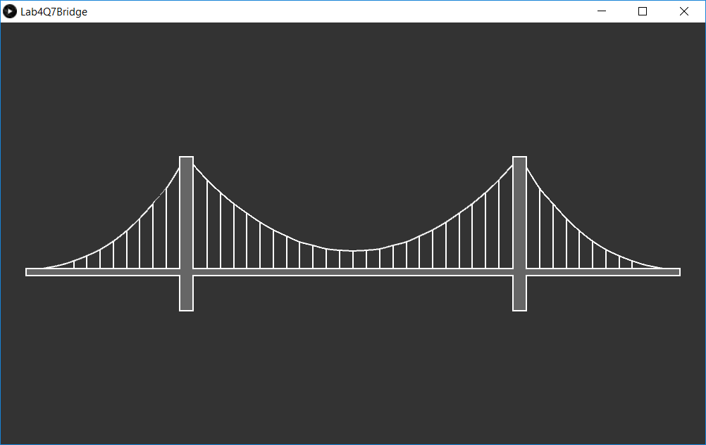

# Bridge 2D

Bridge that moves with cursor, created in Processing

- I modified the original version to work with Javascript
- I added a version that works with points instead of PShape
- The points version was then modified to work with Processing.js online
- The working JavaScript version can be seen here: [Processing.js Version](http://www.joeaoregan.ie/Processing/processing.html#lab4)

## Bridge 1

    <canvas id="canvas5"></canvas>
    
    

Bridge that moves with mouse cursor.

## Bridge 2

 

    <canvas id="canvas6"></canvas>
    
    

Bridge that moves with mouse cursor.

## Screenshots

