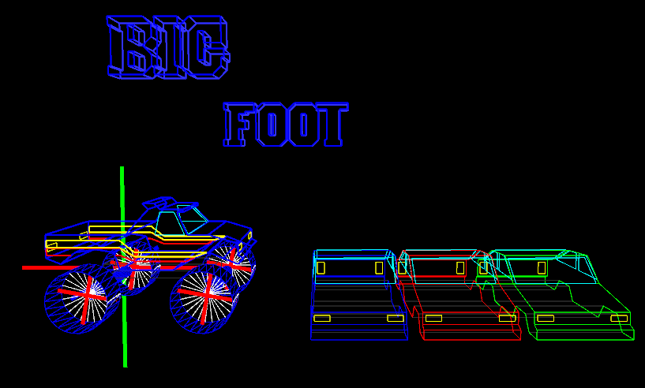

# Continuous Assessment

## P5.js 3D Scene

LIT BSc in Games Design, year 3 Computer Graphics module CA converted from Processing to P5.js.

Take Home Assignment for 3rd year ***Computer Graphics*** module of 
Games Design and Development - BSc (Honours) in Computing (Level 8)

Processing abstracts OpenGL

Continuous assessment for Computer Graphics module
Theme is car racing

Scene should contain at a minimum 4 distinct objects
one static, one scaling, one rotating, and one translating

---

## CA Bigfoot Monster Truck

    

    <canvas id="canvasMain"></canvas>
    
    
    

## Controls:

- **Pause**: P or Spacebar
- **Move Camera**: ASDW or Arrow keys
- **Reset Camera**: Rick-click or ESC key
- **Show / Hide Axes lines**: X key
- **Show / Hide cars**: C key
- **Show / Hide text**: T key
- **Show / Hide wheel lines**: L key
- **Show / Hide Big Foot**: B key
- **Reset Show / Hide (View All Objects)**: R key

## Screenshots

## Files:

 No. | File          | Description 
 --- | ------------- | ------------ 
 1   | **Joe_O_Regan_Graphics_CA_K00203642_V2.pde** | Submitted Version
 2   | **Joe_O_Regan_Graphics_CA_K00203642_V3.pde** | Tidied Up Version
 3   | **joeCAEdit-ProcessingJS.pde**               | ProcessingJS Version 
 